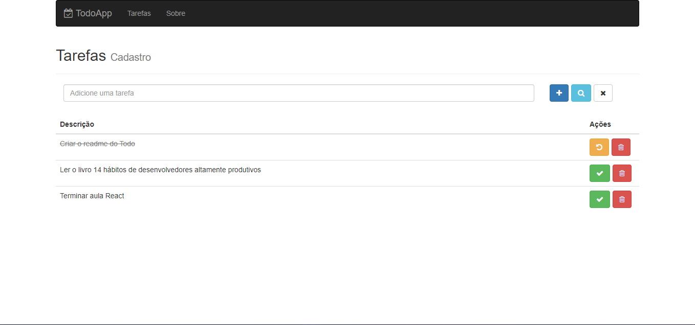

<h1 align="center">
 TodoApp
</h1>
<p align="center">

</p>

<br>

## 🧪 Tecnologias

Esse projeto foi desenvolvido com as seguintes tecnologias:

- [React](https://reactjs.org)
- [Redux](https://redux.js.org/)
- [Styled-components](https://styled-components.com/)

## 🚀 Como executar

Clone o projeto e acesse a pasta do mesmo.

```bash
$ git clone https://github.com/morricedev/todo-frontend
$ cd todo-frontend
```

Para iniciá-lo, siga os passos abaixo:

```bash
# Instalar as dependências
$ npm i

# Iniciar o projeto
$ npm start
```

O app estará disponível no seu browser pelo endereço http://localhost:3000.

Lembrando que será necessário utilizar o backend disponobilizado neste [repositório](https://github.com/morricedev/todo-backend).

## 💻 Projeto

TodoApp é perfeito para que as pessoas possam organizar e gerenciar as tarefas do dia.


## 💭 Planos de implementação

Pretendo substituir - futuramente - a página Sobre pela página Resumo, que irá conter estatíticas de quais e quantas tarefas foram finalizadas no dia.

---

Feito com 💜 by Morrice
